# Smol Audio Pad Project Journal :D

Start of something great. Made by  <a href="https://github.com/tobycm">tobycm</a> for Hack Club's [Pendant](https://pendant.hackclub.com/) YSWS.

1. Picked XIAO nRF52840 for good power efficiency, a small lithium ion battery pouch, a rotary encoder for volume control with integrated switch for play/pause, and 2 switches for next and previous control.

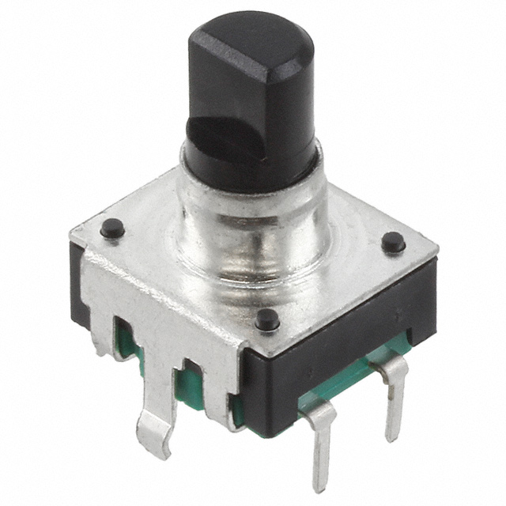
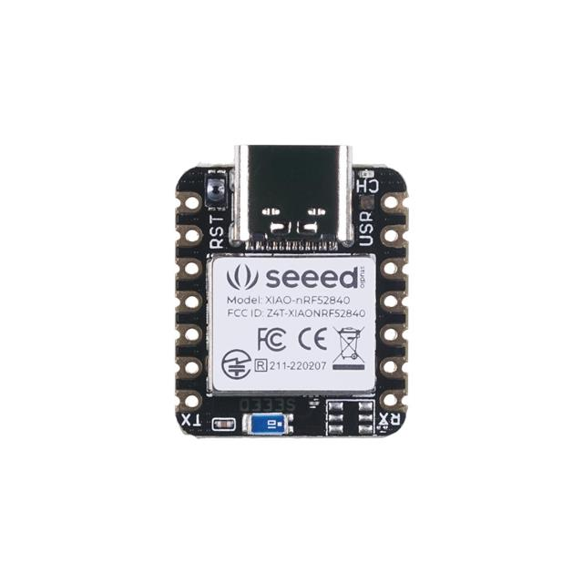

2. Started initial schematic

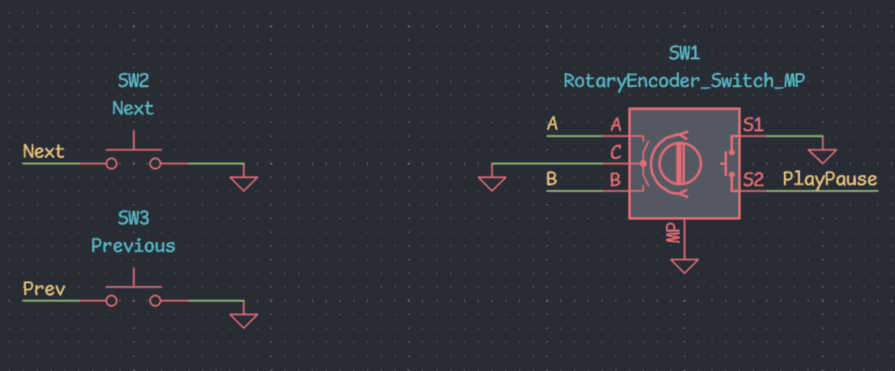

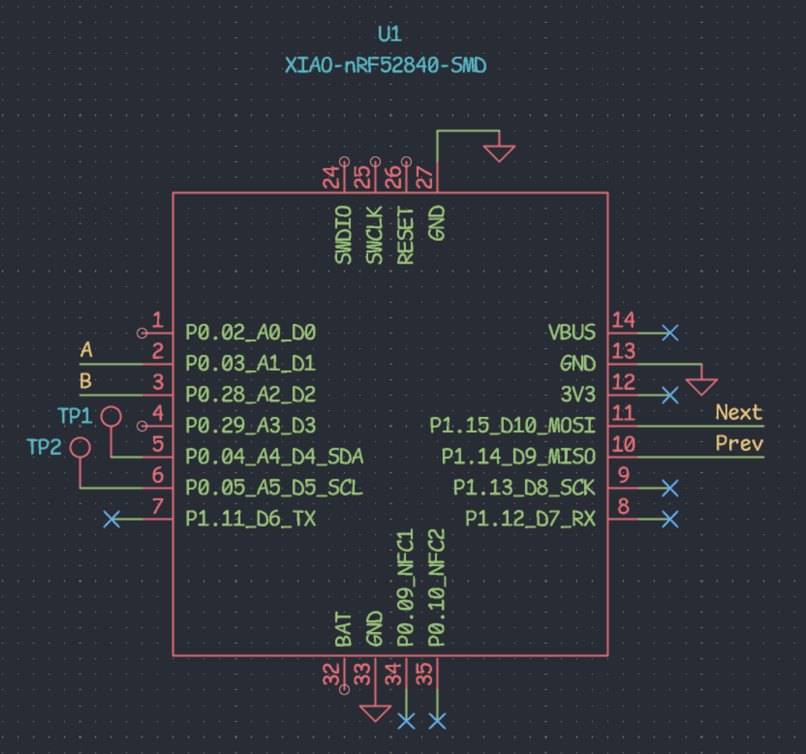

3. General layout

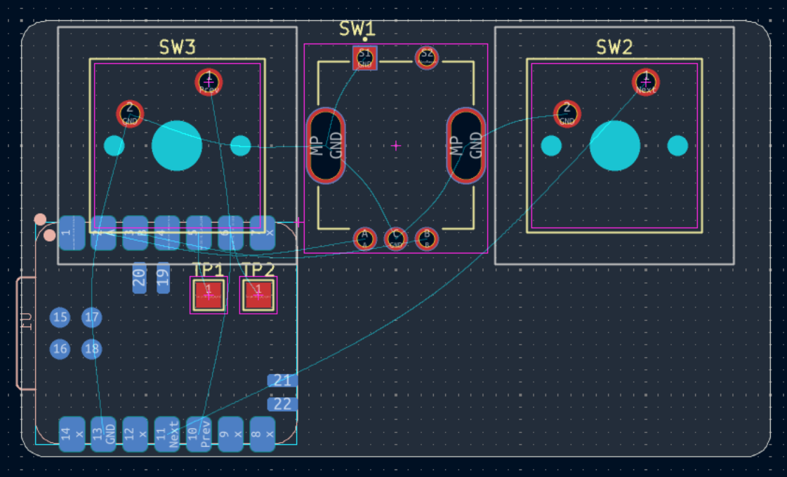
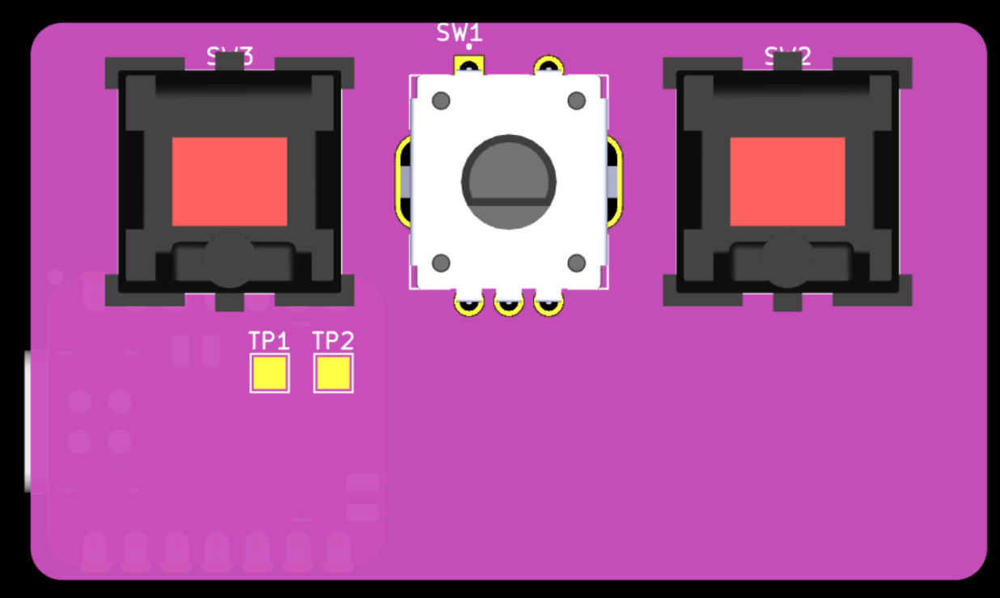

At this point, I realized I have quite a bit of space left, so I think I will add a neopixel and 2 more switches. I also realized that I need battery protection circuit to avoid overcharging and overdischarging.

4. Added a bunch of battery stuff: resistor divider to gauge battery voltage, overcharging and overdischarging protection, JST connector for battery

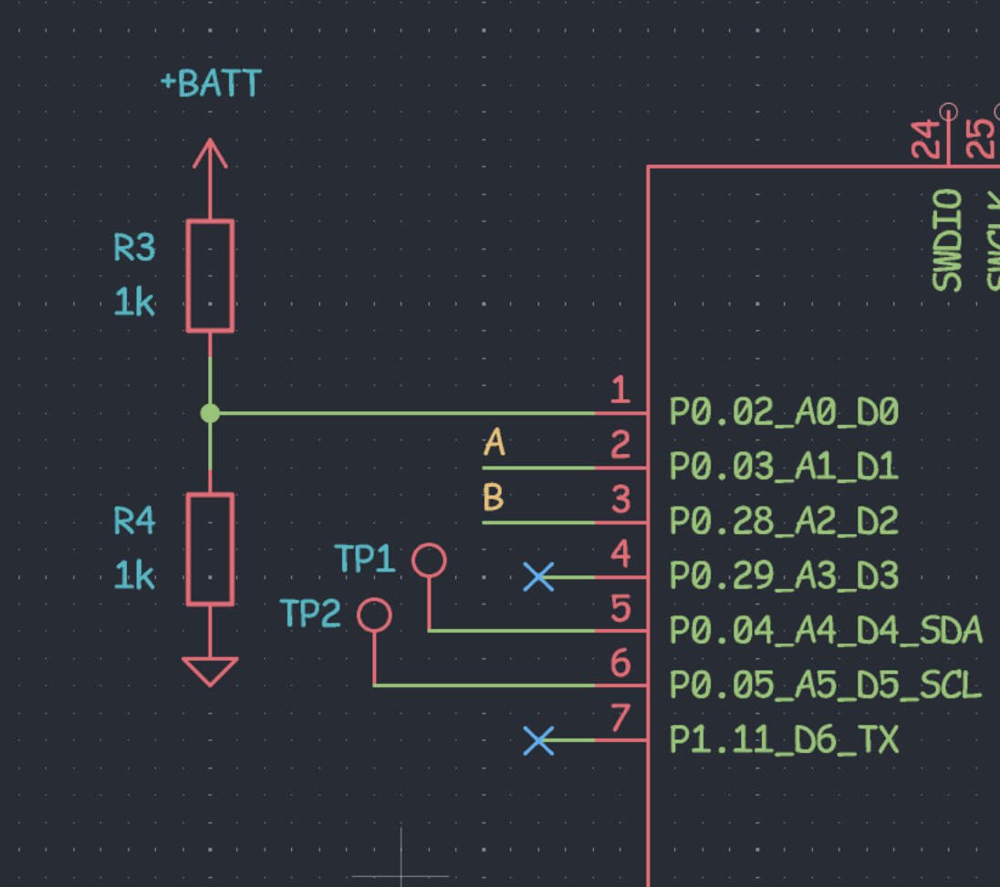
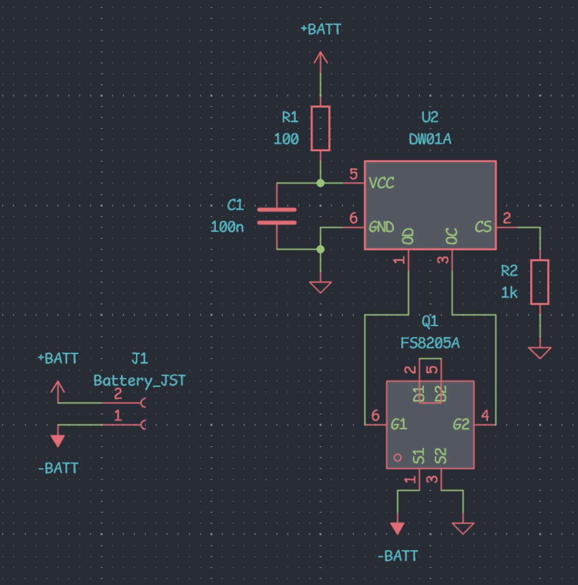

time for more pcb layout 😋

5. PCB Layout and Routing done!

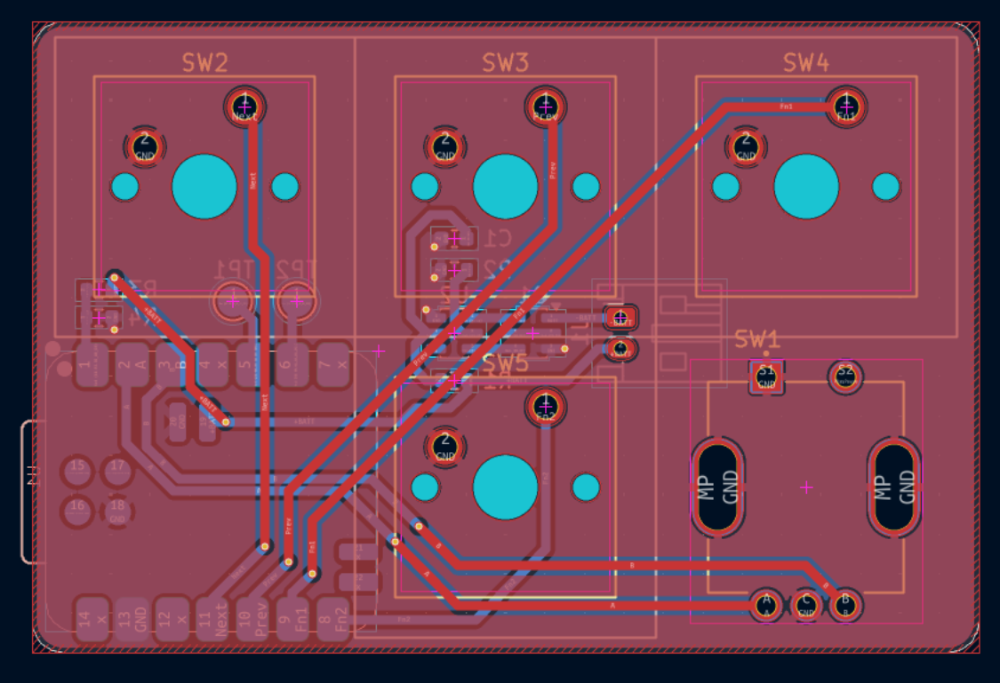
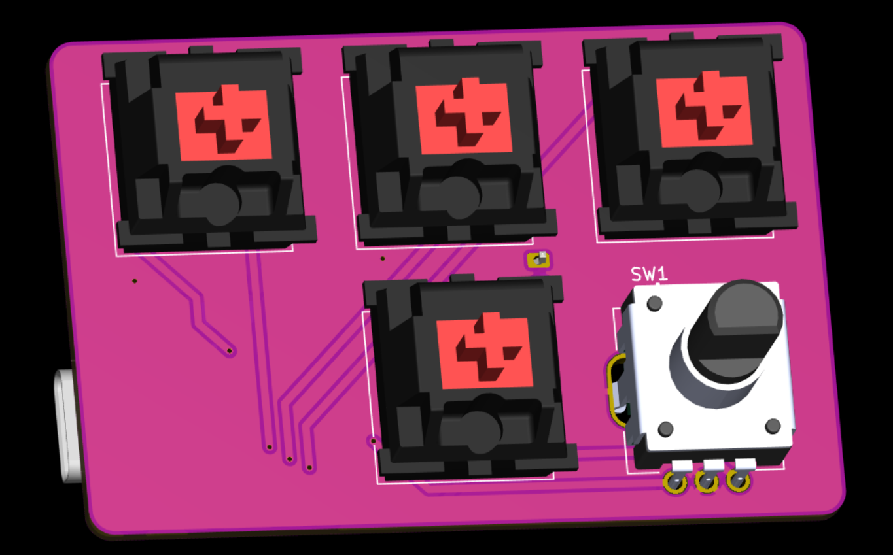
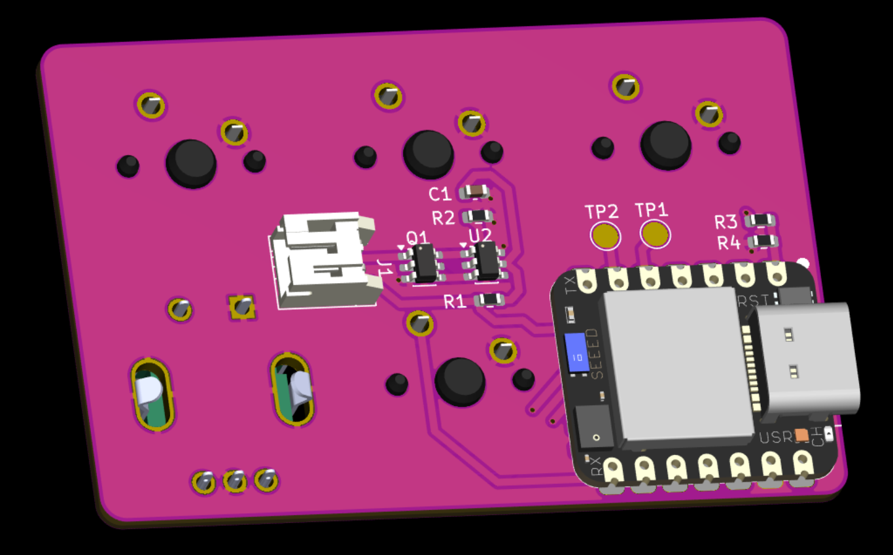

gotta add neopixel and expose swd pads then im done with the pcb :D

nvm no neopixels, just swd pads

6. Added SWD pads for debugging and flashing, as well as mounting bites and holes

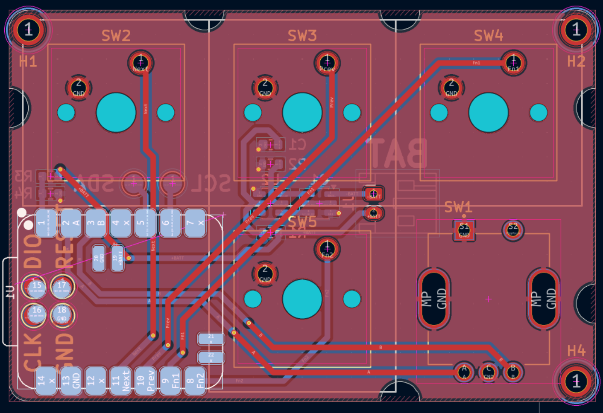
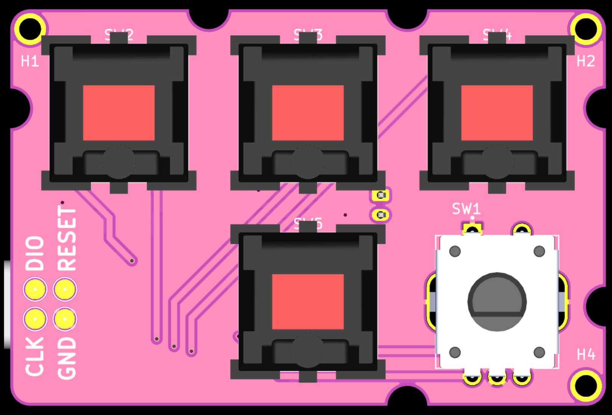
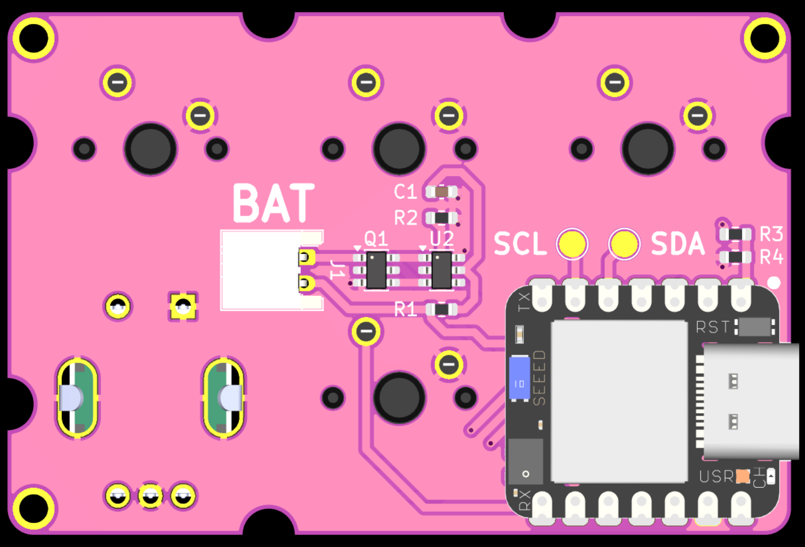

7. Case designing

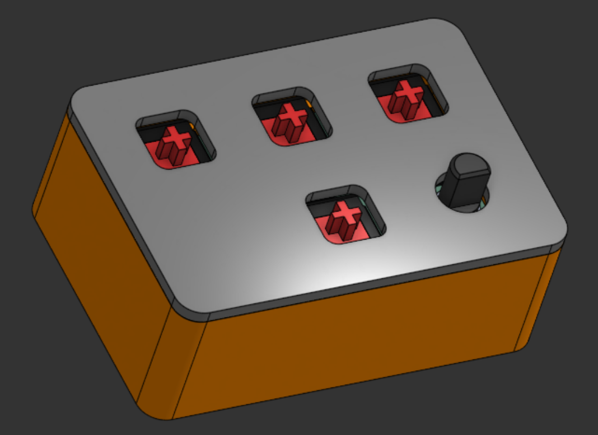

good enough, i left enough of the plus sign to fit the keycaps